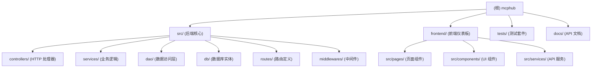

# MCPHub - 项目总览

> **最后更新**: 2025-12-01 12:10:33
> **版本**: dev
> **主要语言**: TypeScript (100%)

## 变更记录 (Changelog)

### 2025-12-01
- 初始化 AI 上下文文档
- 创建根级与模块级架构文档
- 建立导航面包屑与 Mermaid 模块结构图

---

## 项目愿景

MCPHub 是一个统一的 Model Context Protocol (MCP) 服务器管理中心，通过将多个 MCP 服务器组织成灵活的 Streamable HTTP (SSE) 端点，让用户能够轻松管理和扩展 MCP 服务器集群。支持访问所有服务器、单个服务器或逻辑服务器组，并提供智能路由、OAuth 2.0 认证、数据库模式等企业级功能。

**核心价值**：
- 集中管理多个 MCP 服务器
- 灵活的路由策略（全局、分组、单服务器、智能路由）
- 热插拔配置，无需停机即可添加/删除/更新服务器
- 支持 OAuth 2.0 客户端与服务器模式
- 双数据源（JSON 文件 / PostgreSQL）
- Docker 就绪，支持容器化部署

---

## 架构总览

### 技术栈

**后端**:
- **运行时**: Node.js ^18.0.0 || >=20.0.0
- **框架**: Express.js + TypeScript (ESM)
- **协议**: @modelcontextprotocol/sdk v1.20.2
- **认证**: JWT + bcrypt
- **数据层**: TypeORM (PostgreSQL) / JSON 文件
- **向量搜索**: pgvector (智能路由)

**前端**:
- **框架**: React 19.1.1 + Vite 6.3.5
- **样式**: Tailwind CSS 4.1.12
- **国际化**: react-i18next
- **路由**: react-router-dom 7.8.2

**测试 & 质量**:
- **单元测试**: Jest 30.2.0 + ts-jest
- **集成测试**: Supertest 7.1.4
- **代码质量**: ESLint + Prettier
- **覆盖率**: Jest coverage reports

**部署**:
- **容器化**: Docker (Python 3.13 base + Node.js 22)
- **编排**: Docker Compose
- **发布**: NPM package (@samanhappy/mcphub)

### 系统架构

```
┌─────────────────────────────────────────────────────────┐
│                    客户端 (Claude/Cursor)                │
└────────────────────┬────────────────────────────────────┘
                     │ HTTP/SSE
         ┌───────────▼──────────────┐
         │   MCPHub API Gateway     │
         │  (Express + Auth + I18n) │
         └───────────┬──────────────┘
                     │
     ┌───────────────┼───────────────┐
     │               │               │
┌────▼────┐   ┌─────▼─────┐   ┌────▼─────┐
│ MCP     │   │  Vector   │   │  OAuth   │
│ Service │   │  Search   │   │  Service │
└────┬────┘   └───────────┘   └──────────┘
     │
     ├──► Stdio MCP Servers
     ├──► SSE MCP Servers
     ├──► HTTP MCP Servers
     └──► OpenAPI Servers
```

---

## 模块结构图



---

## 模块索引

| 模块 | 路径 | 职责 | 主要技术 | 文档 |
|------|------|------|---------|------|
| **后端核心** | `src/` | MCP 服务编排、API 网关、认证授权、数据持久化 | Express, TypeORM, MCP SDK | [src/CLAUDE.md](./src/CLAUDE.md) |
| **前端仪表板** | `frontend/` | 可视化管理界面、服务器/组/用户管理 | React, Vite, Tailwind CSS | [frontend/CLAUDE.md](./frontend/CLAUDE.md) |
| **测试套件** | `tests/` | 单元测试、集成测试、测试工具 | Jest, Supertest | [tests/CLAUDE.md](./tests/CLAUDE.md) |
| **API 文档** | `docs/` | Mintlify 格式的 API 参考文档 | MDX | [docs/CLAUDE.md](./docs/CLAUDE.md) |

---

## 运行与开发

### 快速启动

```bash
# 1. 安装依赖
pnpm install

# 2. 配置环境变量（可选）
cp .env.example .env

# 3. 开发模式（并行启动前后端）
pnpm dev
# 后端: http://localhost:3000
# 前端: http://localhost:5173

# 或分别启动（Windows 推荐）
pnpm backend:dev  # 终端 1
pnpm frontend:dev # 终端 2
```

### 构建与部署

```bash
# 完整构建
pnpm build

# 启动生产环境
pnpm start

# Docker 部署
docker run -p 3000:3000 -v ./mcp_settings.json:/app/mcp_settings.json samanhappy/mcphub

# Docker Compose (带数据库)
docker-compose -f docker-compose.db.yml up -d
```

### 核心配置文件

| 文件 | 用途 | 说明 |
|------|------|------|
| `mcp_settings.json` | MCP 服务器定义、用户账户、系统配置 | 默认数据源（JSON 模式） |
| `.env` | 环境变量 | `PORT`, `DB_URL`, `USE_DB` 等 |
| `package.json` | 依赖与脚本定义 | pnpm workspace 根 |

---

## 测试策略

### 测试层级

1. **单元测试** (src/**/__tests__/*, tests/*)
   - 覆盖率目标: 实际覆盖关键业务逻辑
   - 运行: `pnpm test`
   - 监控: `pnpm test:watch`

2. **集成测试** (tests/integration/*)
   - SSE 实时连接测试
   - 智能路由端到端测试
   - OpenAPI 集成测试

3. **CI 测试** (.github/workflows/ci.yml)
   - Lint + 类型检查
   - 完整测试套件
   - 构建验证

### 运行测试

```bash
# 交互模式
pnpm test

# CI 模式（快速）
pnpm test:ci

# 覆盖率报告
pnpm test:coverage

# 详细输出
pnpm test:verbose
```

---

## 编码规范

### TypeScript 规范

- **模块系统**: ESM (import/export)
- **导入路径**: 必须使用 `.js` 扩展名（即使是 `.ts` 文件）
- **严格模式**: 启用 TypeScript strict 检查
- **装饰器**: 支持 `experimentalDecorators`（TypeORM 需要）

### 代码风格

- **缩进**: 2 空格
- **引号**: 单引号
- **分号**: 可选（Prettier 自动处理）
- **命名约定**:
  - 服务/DAO: `UserService`, `ServerDao`
  - React 组件: `PascalCase`
  - 工具函数: `camelCase`
  - 常量: `UPPER_SNAKE_CASE`

### 提交规范

遵循 Conventional Commits:
- `feat:` - 新功能
- `fix:` - Bug 修复
- `chore:` - 构建/工具变更
- `docs:` - 文档更新
- `refactor:` - 代码重构
- `test:` - 测试相关

---

## AI 使用指引

### 关键上下文路径

**核心业务逻辑**:
- `src/services/mcpService.ts` - MCP 服务编排核心
- `src/services/sseService.ts` - SSE 连接与消息处理
- `src/services/vectorSearchService.ts` - 智能路由实现
- `src/services/oauthService.ts` - OAuth 客户端集成
- `src/services/oauthServerService.ts` - OAuth 服务器实现

**数据访问层（重要）**:
- `src/dao/` - DAO 接口与 JSON 实现
- `src/dao/*DaoDbImpl.ts` - PostgreSQL 实现
- `src/db/entities/` - TypeORM 实体定义
- `src/utils/migration.ts` - JSON → DB 迁移逻辑

**路由与控制器**:
- `src/routes/index.ts` - 路由定义总入口
- `src/controllers/` - HTTP 请求处理器

**前端入口**:
- `frontend/src/pages/` - 页面组件
- `frontend/src/components/` - 可复用 UI 组件
- `frontend/src/services/` - API 调用封装

### 常见任务

**添加新 API 端点**:
1. 在 `src/routes/index.ts` 定义路由
2. 在 `src/controllers/` 实现处理器
3. 在 `src/types/index.ts` 添加类型（如需要）
4. 在 `tests/controllers/` 添加测试

**修改数据结构（关键）**:
> 参考 AGENTS.md 的"修改数据结构"章节，必须同步更新 7 个位置！

**添加新前端页面**:
1. 在 `frontend/src/pages/` 创建页面组件
2. 在 `frontend/src/App.tsx` 添加路由
3. 在 `frontend/src/components/layout/Sidebar.tsx` 添加导航

### 开发建议

1. **永不取消构建命令** - 所有 `pnpm build`/`test` 必须等待完成
2. **测试先行** - 修改代码前运行 `pnpm test:ci` 确保基线
3. **双数据源兼容** - 数据结构变更必须同时支持 JSON 和 DB 模式
4. **ESM 导入** - 导入本地模块必须加 `.js` 后缀
5. **英文代码注释** - 所有注释必须用英文书写

---

## 常见问题 (FAQ)

**Q: 如何切换到数据库模式？**
A: 设置环境变量 `DB_URL=postgresql://...`，系统会自动检测并启用数据库模式。或明确设置 `USE_DB=true`。

**Q: 前端代理不工作怎么办？**
A: 确保后端已启动在 3000 端口，Vite 会自动代理 `/api`、`/auth`、`/config` 等路径到后端。

**Q: 如何添加新的 MCP 服务器？**
A: 编辑 `mcp_settings.json`，在 `mcpServers` 中添加配置，重启后端即可。

**Q: Docker 镜像如何更新到最新版本？**
A: `docker pull samanhappy/mcphub:latest && docker-compose up -d`

**Q: 测试失败怎么调试？**
A: 运行 `pnpm test:verbose` 查看详细输出，或单独运行失败的测试文件。

---

## 相关资源

- **官方文档**: https://docs.mcphubx.com/
- **在线演示**: https://demo.mcphubx.com/
- **GitHub 仓库**: https://github.com/samanhappy/mcphub
- **Discord 社区**: https://discord.gg/qMKNsn5Q
- **MCP 协议**: https://modelcontextprotocol.io/

---

## 许可证

Apache 2.0 License - 详见 [LICENSE](./LICENSE) 文件
